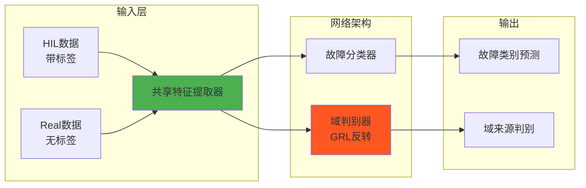
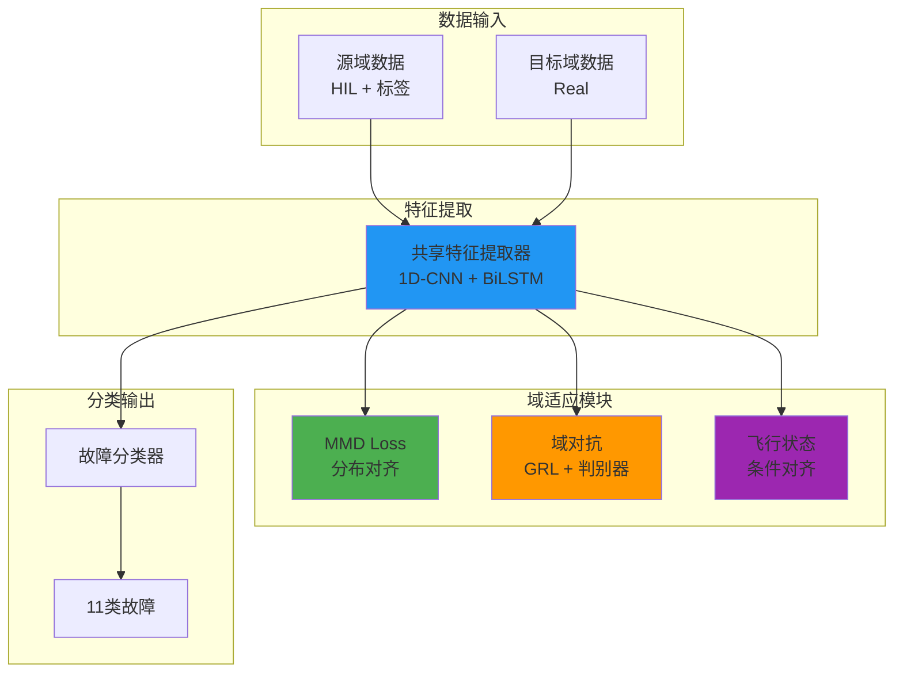
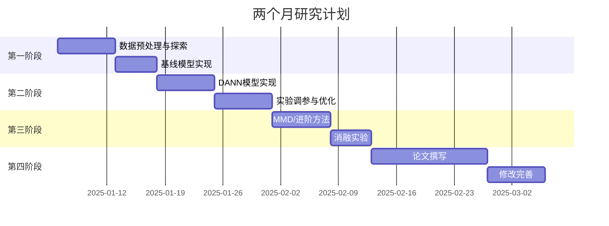

# 基于迁移学习的无人机故障诊断研究方案

## 1. 研究背景与问题定义

### 1.1 研究背景
多旋翼无人机在民用和军事领域的应用日益广泛，其可靠性和安全性至关重要。传统故障诊断方法依赖于大量标注数据，但在实际应用中，**真实飞行故障数据往往难以获取**。仿真环境（HIL/SIL）可以生成大量带标签的故障数据，但仿真数据与真实飞行数据之间存在**域偏移（Domain Shift）**问题。

### 1.2 核心问题
**如何利用丰富的HIL仿真数据训练模型，使其能够有效诊断Real真实飞行中的故障？**

这是一个典型的**无监督域适应（Unsupervised Domain Adaptation, UDA）**问题：
- **源域（Source Domain）**：HIL仿真数据（有标签，2566例）
- **目标域（Target Domain）**：Real真实飞行数据（无标签/少量标签，497例）

### 1.3 数据集概述：RflyMAD
| 属性 | 描述 |
|------|------|
| **故障类型** | 11种：Motor、Propeller、Low Voltage、Wind Affect、Load Lose、Accelerometer、Gyroscope、Magnetometer、Barometer、GPS、No Fault |
| **飞行状态** | 6种：Hover、Waypoints、Velocity Control、Circling、Acceleration、Deceleration |
| **数据规模** | HIL 2566例，Real 497例 |
| **关键特征** | 传感器数据（IMU、磁力计、气压计）、控制指令、位置/速度信息 |

> [!IMPORTANT]
> **域差异分析**：HIL数据包含真值信息（motorRPMs、fault_state），而Real数据是传感器测量值。两者的位置/速度特征存在关键差异（HIL使用期望设定点，Real使用实际值）。

---

## 2. 推荐算法框架

基于您的数据集特点和领域研究现状，我推荐以下**渐进式研究方案**：

### 2.1 方案A：基于DANN的域对抗迁移学习（★推荐入门）



**核心思想**：通过**梯度反转层（Gradient Reversal Layer, GRL）**，训练特征提取器生成"域不变"特征。

**网络结构设计**：

| 模块 | 结构 | 输入维度 | 输出维度 | 说明 |
|------|------|----------|----------|------|
| **特征提取器** | 1D-CNN + LSTM | `(batch, seq_len, n_features)` → `(B, T, F)` | `(batch, hidden_dim)` → `(B, H)` | 提取时序特征，`F≈20`特征通道，`T=100`时间步 |
| **故障分类器** | 全连接层 × 2 | `(B, H)` → H=128 | `(B, 11)` | 11种故障类别（含无故障）|
| **域判别器** | 全连接层 × 2 + GRL | `(B, H)` | `(B, 1)` | 二分类：HIL vs Real |

**损失函数**：
$$\mathcal{L}_{total} = \mathcal{L}_{cls}(y_{src}, \hat{y}_{src}) + \lambda \cdot \mathcal{L}_{domain}(d, \hat{d})$$

其中：
- $\mathcal{L}_{cls}$：交叉熵分类损失（仅源域）
- $\mathcal{L}_{domain}$：域判别损失（对抗训练）
- $\lambda$：域适应权重，建议从0逐渐增加到1

---

### 2.2 方案B：基于MMD的深度域适应网络（进阶方案）

**核心改进**：在DANN基础上，显式最小化源域和目标域特征分布的**最大均值差异（MMD）**。

$$MMD(X_s, X_t) = \left\| \frac{1}{n_s}\sum_{i=1}^{n_s}\phi(x_i^s) - \frac{1}{n_t}\sum_{j=1}^{n_t}\phi(x_j^t) \right\|_{\mathcal{H}}$$

**网络架构改进**：
```
输入 → 1D-CNN → LSTM → [MMD对齐层] → 全连接 → 输出
                              ↓
                        计算MMD损失
```

**多核MMD损失**（推荐使用高斯核）：
$$\mathcal{L}_{MMD} = \sum_{k} \beta_k \cdot MMD^2_k$$

其中$\beta_k$为不同尺度高斯核的权重。

---

### 2.3 方案C：联合对抗MMD网络（创新点方案）

**核心创新**：结合DANN的对抗训练与MMD的显式分布对齐，并针对无人机数据特点引入**飞行状态条件适应**。



**总损失函数**：
$$\mathcal{L} = \mathcal{L}_{cls} + \alpha \mathcal{L}_{MMD} + \beta \mathcal{L}_{domain} + \gamma \mathcal{L}_{flight\_state}$$

---

## 3. 详细技术方案

### 3.1 数据预处理流程


**选择的共同特征（约20维）**：

| 类别 | 特征名称 | 维度 |
|------|----------|------|
| 控制指令 | `_actuator_controls_0_0_control` | 4 |
| PWM输出 | `_actuator_outputs_0_output` | 4 |
| 陀螺仪 | `_sensor_combined_0_gyro_rad` | 3 |
| 加速度计 | `_sensor_combined_0_accelerometer_m_s2` | 3 |
| 气压计 | `_vehicle_air_data_0_baro_alt_meter` | 3 |
| 姿态 | `_vehicle_attitude_0_q` | 4 |
| **总计** | | **~21维** |

### 3.2 网络架构详细设计

```python
# 维度变化说明（以方案A为例）
# 输入: (batch_size=32, seq_len=100, n_features=21)

class FeatureExtractor(nn.Module):
    """
    特征提取器：1D-CNN + LSTM
    
    维度变化:
    输入: (B, T, F) = (32, 100, 21)
    1D-Conv1: (B, 64, T) = (32, 64, 100)  # 卷积核提取局部特征
    1D-Conv2: (B, 128, T) = (32, 128, 50) # 池化降采样
    LSTM: (B, hidden_dim) = (32, 128)     # 时序建模，取最后状态
    """
    
class FaultClassifier(nn.Module):
    """
    故障分类器
    
    维度变化:
    输入: (B, 128)
    FC1: (B, 64) + ReLU + Dropout
    FC2: (B, 11)  # 11种故障类别
    输出: (B, 11) Softmax概率
    """

class DomainDiscriminator(nn.Module):
    """
    域判别器（含GRL）
    
    维度变化:
    输入: (B, 128) → GRL反转梯度
    FC1: (B, 64) + ReLU
    FC2: (B, 1)   # 二分类：0=HIL, 1=Real
    """
```

### 3.3 训练策略

| 阶段 | Epoch | 学习率 | 域适应权重λ | 说明 |
|------|-------|--------|-------------|------|
| 预热 | 1-10 | 1e-3 | 0 | 仅训练分类器 |
| 适应 | 11-50 | 1e-4 | 0→1 | 逐渐增加域适应 |
| 精调 | 51-100 | 1e-5 | 1 | 稳定训练 |

**梯度反转系数调度**：
$$\lambda_p = \frac{2}{1 + \exp(-10 \cdot p)} - 1$$
其中$p = \frac{epoch}{total\_epochs}$

---

## 4. 两个月研究计划

### 4.1 时间线概览



### 4.2 详细周计划

| 周次 | 日期 | 任务 | 交付物 |
|------|------|------|--------|
| **第1周** | 1.6-1.12 | 数据预处理：解析CSV、特征对齐、数据集划分 | 预处理脚本、数据分析报告 |
| **第2周** | 1.13-1.19 | 基线模型：无迁移的CNN/LSTM分类器 | 基线准确率报告 |
| **第3周** | 1.20-1.26 | DANN核心实现：特征提取器+域判别器 | DANN初版代码 |
| **第4周** | 1.27-2.2 | DANN调优：GRL系数、网络深度、学习率 | 优化后DANN模型 |
| **第5周** | 2.3-2.9 | MMD方法实现与对比 | MMD/DANN对比报告 |
| **第6周** | 2.10-2.16 | 消融实验：模块有效性验证 | 完整实验结果表格 |
| **第7周** | 2.17-2.23 | 论文初稿：引言、方法、实验部分 | 论文初稿 |
| **第8周** | 2.24-3.2 | 论文修改、可视化、投稿准备 | 最终论文稿 |

---

## 5. 预期成果

### 5.1 学术成果
1. **核心贡献**：提出一种针对"仿真到真实"（Sim-to-Real）场景的无人机故障诊断迁移学习方法
2. **目标期刊/会议**（按难度排序）：
   - **高水平**：IEEE TNNLS, Mechanical Systems and Signal Processing
   - **中等**：IEEE Sensors Journal, Neurocomputing
   - **入门级**：IEEE Access, Aerospace Science and Technology

### 5.2 技术指标预期

| 指标 | 基线（无迁移） | DANN | 目标（最终方法） |
|------|---------------|------|-----------------|
| Real域准确率 | ~50% | ~75% | **>85%** |
| F1-Score | ~0.45 | ~0.70 | **>0.80** |
| 跨飞行状态泛化 | 差 | 中等 | 良好 |

### 5.3 代码交付物

```
project/
├── config/
│   └── config.yaml          # 所有超参数配置
├── data/
│   ├── preprocess.py         # 数据预处理
│   └── dataloader.py         # 数据加载器
├── models/
│   ├── baseline.py           # 基线CNN/LSTM
│   ├── dann.py               # DANN模型
│   ├── mmd_net.py            # MMD网络
│   └── layers.py             # GRL等自定义层
├── train.py                  # 训练脚本
├── evaluate.py               # 评估脚本
├── utils/
│   └── metrics.py            # 评估指标
└── experiments/
    └── ablation.py           # 消融实验
```

---

## 6. 用户确认事项

> [!WARNING]
> 请确认以下关键决策：

1. **研究目标确认**：
   - [ ] HIL → Real 迁移（推荐）
   - [ ] SIL → Real 迁移
   - [ ] 跨飞行状态迁移

2. **算法选择确认**：
   - [ ] 方案A：DANN（入门推荐，2-3周可完成）
   - [ ] 方案B：MMD网络
   - [ ] 方案C：联合方法（创新性高，时间较紧）

3. **故障类型范围**：
   - [ ] 全部11种故障
   - [ ] 仅执行器故障（Motor/Propeller）
   - [ ] 仅传感器故障

4. **开发环境确认**：
   - 您使用的深度学习框架：PyTorch / TensorFlow？
   - GPU资源情况？

---

## 7. 下一步行动

待您确认上述决策后，我将立即开始：

1. **创建项目结构**和配置文件模板
2. **实现数据预处理脚本**
3. **构建基线模型**作为对比基准
4. **逐步实现迁移学习方法**

> [!TIP]
> 作为入门级研究员，建议从**方案A（DANN）**开始。该方法概念清晰、实现难度适中，且在故障诊断领域已有充分验证。完成后可考虑扩展到方案B或C以增加创新点。
